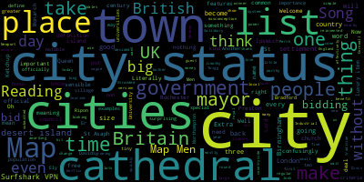

# YT-WordCloud
A Python Project using libraries to turn a youtube video's english subtitles onto a wordcloud.
## Usage
Get a Youtube Video URL, (not youtu.be) and copy it over, then watch it turn onto an image that Matplotlib shows.
## Examples
There is one example of a youtube video, it's EN-GB subtitle as a .txt and the wordcloud image.

 [> Why British cities make no sense - Jay Foreman](https://www.youtube.com/watch?v=Whqs8v1svyo&t=444s)

## Installation
### Binaries
#### GNU/Linux
A Generic Linux x86 binary will be available in the Releases tab.
You may have to allow it to run as an excutable.
### Python 3.x
You can also choose to run the .py file with the libraries you've installed.

1. Clone the repository or download it as a ZIP.
2. Install the required libraries via pip
`pip install requc.txt`
3. Now run the python3 file.

Windows: `python main.py`

Unix(MacOS/Linux/BSD): `python3 main.py`

